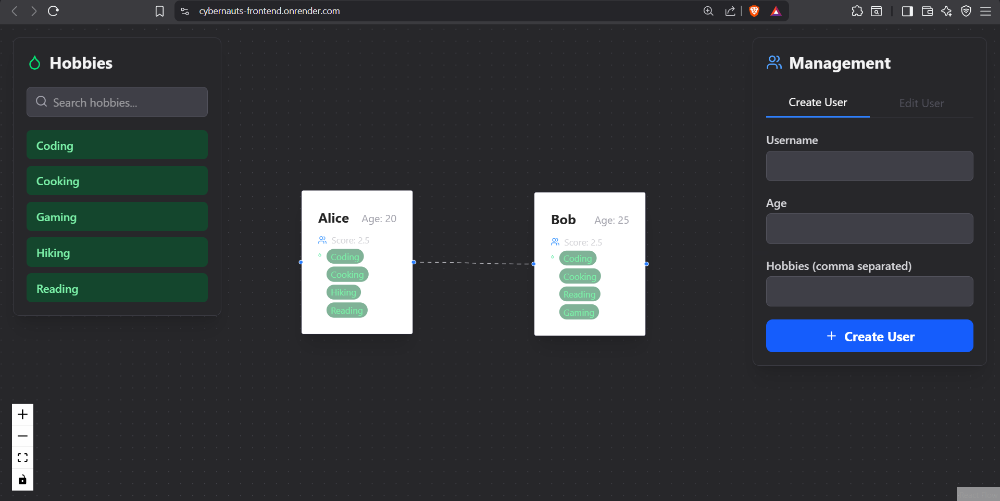

# Project: Interactive User Relationship & Hobby Network
### Cybernauts Development Assignment

This is a full-stack MERN application that manages users and their relationships, visualized as a dynamic, interactive graph using React Flow.

The backend is a production-ready, clustered Node.js (Express + TypeScript) API, and the frontend is a modern, responsive UI built with React (Vite + TypeScript), Redux Toolkit, and Tailwind CSS.

## Live Demo

**https://cybernauts-frontend.onrender.com**


## Screenshot



---

## Tech Stack

* **Backend:** Node.js, Express, TypeScript, MongoDB (with Mongoose)
* **Frontend:** React, Vite, TypeScript, Redux Toolkit, React Flow, Tailwind CSS
* **API & State:** Axios, Redux Toolkit (for async thunks & state management)
* **Testing:** Jest, Supertest, `mongodb-memory-server`
* **Deployment:** Render

---

## Core Features

* **Full CRUD Functionality:** Create, Read, Update, and Delete users via the Management panel.
* **Dynamic Graph Visualization:** All users are rendered as nodes, and friendships as edges, using React Flow.
* **Relationship Management:**
    * **Create Links:** Create friendships by dragging from one user node to another.
    * **Remove Links:** Delete friendships by clicking an edge and pressing 'Backspace'.
* **Live Popularity Score:** Each user has a computed `popularityScore` that updates in real-time.
    * *Formula:* `score = (number of friends) + (total hobbies shared with friends × 0.5)`
* **State Consistency:** All API actions (create, update, link) return the complete, updated graph state, ensuring the frontend is always in sync with the backend.
* **Business Logic:**
    * **Deletion Rule:** A user *cannot* be deleted while still linked to friends.
    * **Mutual Friendships:** A-B and B-A links are treated as a single mutual connection.
* **Modern Responsive UI:**
    * Sleek dark-mode UI with floating panels.
    * Fully responsive for both mobile and desktop.
    * Toast notifications for all actions (success, loading, error).
    * Modal confirmation before user deletion.

---

## Bonus Features Implemented

This project successfully implements all major bonus points:

* **7. Development & Scaling (Clustering):** The backend uses the **Node.js `cluster` API** (`backend/src/index.ts`) to fork a worker for each available CPU core, making it a high-performance, production-ready server.

* **8. API Test Coverage:** The backend has a full test suite (`backend/src/tests/logic.test.ts`). Running `npm test` in the `backend` folder will:
    1.  Spin up an in-memory MongoDB server.
    2.  Run 6 tests to validate all core business logic, including:
        * Correct Popularity Score calculation.
        * Relationship creation.
        * The deletion conflict rule (failing to delete a linked user).

* **9. Custom React-Flow Nodes:** The app uses two distinct node types: `LowScoreNode` (default) and `HighScoreNode` (for scores > 5). This is implemented by:
    1.  **Backend:** The `/api/graph` endpoint checks each user's score and sets the node `type` in the JSON response.
    2.  **Frontend:** `CustomNodes.tsx` defines the two components. The `HighScoreNode` automatically renders with a yellow border and a star icon.

* **10. Performance Optimisation (Debounce):**
    * The drag-and-drop hobby feature (`onDrop` in `CustomNodes.tsx`) is **debounced by 300ms**.
    * This prevents spamming the API with `PUT` requests if a user rapidly drags multiple hobbies, ensuring a smooth and performant experience.

---

## Setup & Installation

This is a monorepo. You will need to run two servers in two separate terminals.

### 1. Backend Setup

1.  Navigate to the `backend` folder:
    ```bash
    cd backend
    ```
2.  Install all dependencies (including `devDependencies`):
    ```bash
    npm install
    ```
3.  Create a `.env` file in the `backend` folder. Copy the contents from `.env.example`.
4.  Add your **MongoDB Atlas connection string** as `MONGO_URI` in your `.env` file.
5.  Start the development server:
    ```bash
    npm run dev
    ```
    *The server will be running on `http://localhost:5000`.*

### 2. Frontend Setup

1.  In a **new terminal**, navigate to the `frontend` folder:
    ```bash
    cd frontend
    ```
2.  Install dependencies:
    ```bash
    npm install
    ```
3.  Start the development server:
    ```bash
    npm run dev
    ```
    *The app will be running on `http://localhost:5173`.*

---

## API Documentation

All API endpoints, request bodies, and responses are documented in the **`API_DOCS.md`** file included in this repository.